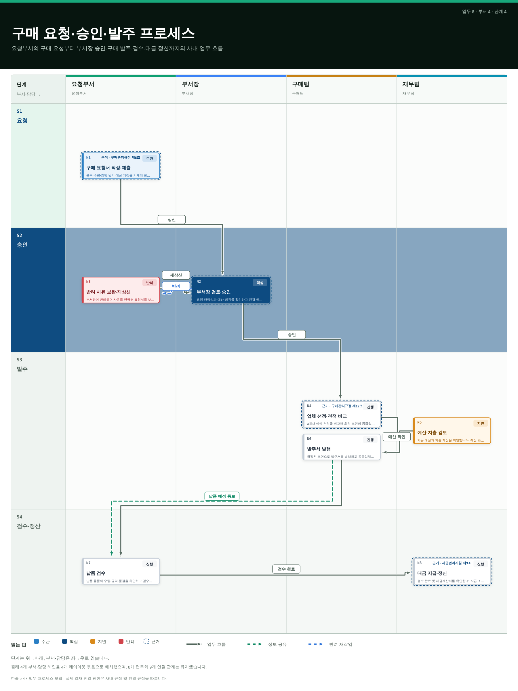

# 한솔 업무 프로세스 보드 (Hansol Process Board)

한솔 사내 **업무 프로세스를 부서(담당) × 단계 × 업무**의 표준 스윔레인
보드로 시각화하는 시스템입니다. 어떤 업무 절차든 —
**부서(레인) × 단계(게이트) × 업무(카드)** 로 정리해 **SVG(선택적으로 PNG)**
보드로 렌더링하고, 구성 품질을 **자동 점검(audit)** 하며, 단계 순서대로 나타나는
**리빌 애니메이션**까지 생성합니다.

특징은 두 가지입니다.

- **AI로 손쉽게 입력** — 업무를 말로 설명하거나 규정·업무분장표·회의록을 붙여넣으면,
  Claude Code가 이를 표준 보드(JSON)로 자동 변환합니다. 담당자가 JSON 문법을 몰라도
  됩니다. → [`docs/manual/02-AI-입력-가이드.md`](docs/manual/02-AI-입력-가이드.md)
- **표준 양식 + 품질 검증** — 모든 보드는 하나의 스키마(`board-v1`)를 따르고,
  `audit`/`validate`로 가독성(선 겹침·꼬임)을 정량 점검하므로 부서마다 제각각인
  그림이 아니라 **일관된 사내 표준 산출물**이 됩니다.

Claude Code(및 Codex) 안에서 `SKILL.md` 진입점과 무설치(net-zero dependency에 가까운)
ESM CLI(`scripts/board.mjs`)로 동작합니다.

## 미리보기

`hansol` 프로파일로 렌더링한 구매 요청·승인·발주 프로세스 예시입니다
(원본: [`fixtures/hansol-sample.json`](fixtures/hansol-sample.json)):



같은 엔진으로 세 가지 프로파일을 제공합니다 — 한솔 사내용(`hansol`),
중립 영문(`default`), 한국 행정용(`gov`):

| `default` (중립 영문) | `gov` (행정) |
|---|---|
|  |  |

보드는 단계 순서대로 나타나는 리빌 애니메이션(자기완결형 SMIL SVG)도 내보냅니다 —
[`assets/example-hansol-motion.svg`](assets/example-hansol-motion.svg) 참고
(`node scripts/board.mjs motion fixtures/hansol-sample.json` 로 생성).

## 설치

**에이전트 스킬로** (Claude Code / Codex) — 스킬 디렉터리에 클론하면 에이전트가
`SKILL.md`를 인식합니다:

```bash
# Claude Code
git clone https://github.com/evelynn/Hansol-100.git ~/.claude/skills/hansol-process-board
# Codex
git clone https://github.com/evelynn/Hansol-100.git ~/.agents/skills/hansol-process-board

cd ~/.claude/skills/hansol-process-board   # 클론한 위치로 이동
npm install && npm test
```

**CLI로** (아무 프로젝트에서나) — 저장소를 클론한 뒤:

```bash
git clone https://github.com/evelynn/Hansol-100.git
cd Hansol-100 && npm install
node scripts/board.mjs render fixtures/hansol-sample.json --out board.svg
```

## 빠른 시작

```bash
# 보드를 SVG로 렌더링 (rsvg-convert 또는 cairosvg가 설치돼 있으면 PNG도 함께)
node scripts/board.mjs render fixtures/hansol-sample.json --out board.svg --png

# 구성 품질 점검 (선 겹침·꼬임·꺾임·경로 늘어짐)
node scripts/board.mjs audit fixtures/hansol-sample.json

# 품질 기준 통과 여부 게이트 (--strict 시 기준 초과면 종료코드 1)
node scripts/board.mjs validate fixtures/hansol-sample.json --strict

# 단계 순서 리빌 애니메이션 (자기완결형 애니메이션 SVG)
node scripts/board.mjs motion fixtures/hansol-sample.json --out board.motion.svg
```

## CLI

| 명령 | 용도 |
|---|---|
| `render <board.json> [--out f.svg] [--png] [--profile p]` | 보드를 SVG로 렌더링 (래스터라이저가 있으면 PNG도) |
| `audit <board.json> [--profile p]` | 구성 품질 점수 + 지표 출력 |
| `validate <board.json> [--strict] [--profile p]` | 스키마 + 구성 품질 게이트 (strict 위반 시 종료코드 1) |
| `motion <board.json> [--out f.svg] [--profile p]` | 단계 리빌 애니메이션 SVG |
| `check <file.svg>` | SVG 구조 정합성 점검 |

## 입력 형식

보드는 [`schemas/board-v1.schema.json`](schemas/board-v1.schema.json) 스키마를 따릅니다:
`lanes`(부서·담당) × `stages`(단계) × `nodes`(`{id, lane, stage, label, emphasis,
refs}` 업무 카드) × `edges`(`{id, source, target, type}` 연결).

- **직접 입력 방법(입력 매뉴얼):**
  [`docs/manual/01-업무프로세스-입력-매뉴얼.md`](docs/manual/01-업무프로세스-입력-매뉴얼.md)
- **AI로 입력하는 방법(권장):**
  [`docs/manual/02-AI-입력-가이드.md`](docs/manual/02-AI-입력-가이드.md)
- 필드 매핑 원리와 워크드 예제: [`references/authoring.md`](references/authoring.md)
- 시작용 골격: [`templates/board.template.json`](templates/board.template.json)

## 프로파일

- **`hansol`** — 한솔 사내용. 결재 흐름에 맞춘 한글 배지(주관/핵심/진행/지연/반려),
  부서·담당 기준 축·범례, 사내 규정 인용을 위한 `근거` 라벨, 코퍼레이트 블루 강조색.
- **`default`** — 중립 영문. 어떤 도메인에도 무난한 파랑/슬레이트 팔레트.
- **`gov`** — 한국 행정용(선행/핵심/병목/회귀 배지, 조문 인용).

`--profile`로 선택하거나 보드 JSON의 `"profile"` 필드로 지정합니다.
자세한 내용: [`references/profiles.md`](references/profiles.md).

## 출력 및 의존성

순수 Node.js(≥20), 스키마 검증용 의존성 1개(`ajv`)만 사용합니다. **SVG는 항상**
생성됩니다. PNG는 `rsvg-convert`(librsvg) 또는 `cairosvg`가 `PATH`에 있을 때만
추가로 생성됩니다. 애니메이션 출력은 자기완결형 SVG(SMIL, JS·외부 리소스 없음)입니다.

## 구성 품질

`audit`/`validate` 명령은 렌더링된 보드의 기하 배치를 점수화합니다. 핵심 지표는
**node-piercings** — 관련 없는 카드 뒤로 선이 지나가 z-순서에 가려지는 경우입니다.
렌더러의 거터 라우팅이 같은 행/회귀 선을 카드 뒤로 지나가지 않게 유지합니다.
자세한 내용: [`references/composition-quality.md`](references/composition-quality.md).

## 문서

- [`docs/manual/`](docs/manual/) — 사내 도입·입력 매뉴얼 모음
  - [`00-소개.md`](docs/manual/00-소개.md) — 시스템 개요와 도입 배경
  - [`01-업무프로세스-입력-매뉴얼.md`](docs/manual/01-업무프로세스-입력-매뉴얼.md) — 직접 입력 방법 (담당자용)
  - [`02-AI-입력-가이드.md`](docs/manual/02-AI-입력-가이드.md) — AI로 손쉽게 입력하기 (권장)

## 라이선스 및 출처

MIT 라이선스. 본 시스템은 오픈소스 프로세스 렌더러
[korea100studio](https://github.com/hosungseo/korea100studio)(MIT © 2026 Hosung Seo)를
한솔 사내 업무 프로세스용으로 커스터마이즈한 것입니다. 원 저작권 표시는
[`LICENSE`](LICENSE)에 그대로 유지됩니다.
